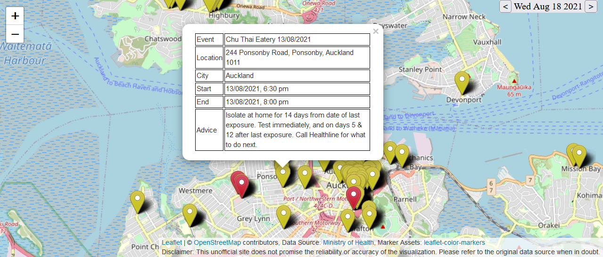

# Covid-19 Locations of Interest Viewer

~~Visit: https://covid19-nz-loi.netlify.app/~~ (The API has been deprecated)

NZers are encouraged to keep track of the locations of interest during this new covid-19 outbreak. When the data was initially [published by the government](https://www.health.govt.nz/our-work/diseases-and-conditions/covid-19-novel-coronavirus/covid-19-health-advice-public/contact-tracing-covid-19/covid-19-contact-tracing-locations-interest/covid-19-contact-tracing-locations-interest-map), I couldn't find an user friendly map interface on which the locations are visualized in an intuitive manner. So I created this tool to help people like me check LOIs on a daily basis.

Red marks indicate locations visited by some positive case on the selected day (high risk if you happened to be at the same address on that day, check the specific time!), whereas yellow marks indicate locations visited by them on other days.

Stay home, stay safe :)

Update:

I later found that a map interface is provided after an update of the [Ministry of Health website](https://www.health.govt.nz/our-work/diseases-and-conditions/covid-19-novel-coronavirus/covid-19-health-advice-public/contact-tracing-covid-19/covid-19-contact-tracing-locations-interest/covid-19-contact-tracing-locations-interest-map). But I still consider this tool a little easier to use, especially when filtering by day is a feature you want.
